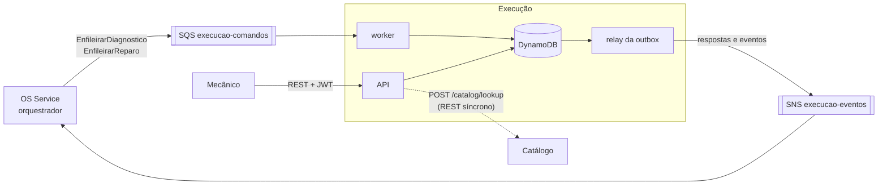
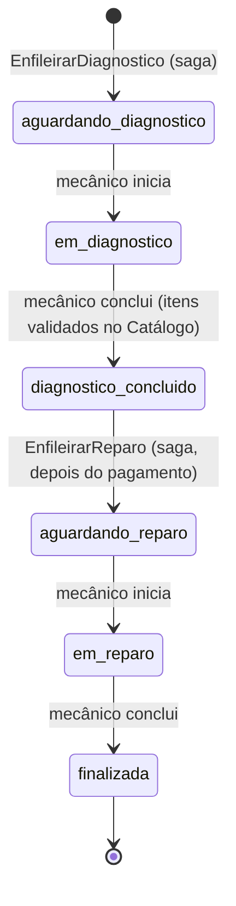

# oficina-mecanica-execucao

Microsserviço de **Execução** do sistema da oficina mecânica (Tech Challenge FIAP, Fase 4): gerencia a **fila de diagnóstico e de reparo** das ordens de serviço. O mecânico conduz cada etapa por aqui: é no diagnóstico que ele define quais serviços e peças a OS precisa, e isso vira o orçamento ([ADR-0010](https://github.com/phantosmia/oficina-mecanica-fiap/blob/main/docs/adrs/0010-diagnostico-define-o-orcamento.md)).

É um dos 5 microsserviços do sistema. A divisão, a saga e o contrato entre os serviços estão documentados no repositório principal, [oficina-mecanica-fiap](https://github.com/phantosmia/oficina-mecanica-fiap):

- [RFC-0006: decomposição em microsserviços](https://github.com/phantosmia/oficina-mecanica-fiap/blob/main/docs/rfcs/0006-decomposicao-em-microsservicos.md)
- [ADR-0008](https://github.com/phantosmia/oficina-mecanica-fiap/blob/main/docs/adrs/0008-saga-orquestrada-no-os-service.md) e [ADR-0010](https://github.com/phantosmia/oficina-mecanica-fiap/blob/main/docs/adrs/0010-diagnostico-define-o-orcamento.md): a saga orquestrada
- [ADR-0009: persistência poliglota (por que DynamoDB aqui)](https://github.com/phantosmia/oficina-mecanica-fiap/blob/main/docs/adrs/0009-persistencia-poliglota-por-servico.md)
- [`docs/saga.md`: contrato de mensagens entre os serviços](https://github.com/phantosmia/oficina-mecanica-fiap/blob/main/docs/saga.md)

## Papel no sistema



### Etapas de uma OS na Execução



Entre `diagnostico_concluido` e `aguardando_reparo` a OS está fora daqui: o orquestrador reserva as peças (Estoque), gera o orçamento e espera a aprovação (Orçamento), depois cobra e espera o pagamento (Pagamento). Se a saga for compensada nesse meio, a OS simplesmente nunca recebe o `EnfileirarReparo`.

### Mensagens

| Recebe (fila `execucao-comandos`) | Responde |
|---|---|
| `EnfileirarDiagnostico` (problema relatado e veículo) | `DiagnosticoEnfileirado` ou `EnfileiramentoFalhou` |
| `EnfileirarReparo` (depois do pagamento; **ponto sem volta** da saga) | `ReparoEnfileirado` ou `EnfileiramentoFalhou` |

| Publica (ação do mecânico) | Payload |
|---|---|
| `DiagnosticoIniciado` | — |
| `DiagnosticoConcluido` | Notas do mecânico, serviços e peças com preço unitário e subtotal copiados do Catálogo, totais de mão de obra, peças e geral. É o que a saga usa para reservar as peças e gerar o orçamento |
| `ReparoIniciado` | — |
| `ExecucaoFinalizada` | Notas do reparo |

## Arquitetura do serviço

Clean Architecture, a mesma organização dos outros serviços:

```
app/
├── execution/
│   ├── domain/        # ExecutionJob (etapas e transições), Diagnosis, portas (repositório e Catálogo)
│   ├── application/   # use_cases.py (ações do mecânico) e saga_handlers.py (comandos da saga)
│   ├── adapters/      # repositório DynamoDB, cliente HTTP do Catálogo, presenter
│   ├── controller.py  # rotas REST
│   └── schemas.py
├── messaging/         # dispatcher e consumidor SQS
├── system/            # /health e /ready
├── shared/            # settings, JWT, DynamoDB, envelope, outbox, publicador SNS, tracing, logs
├── worker.py          # processo consumidor da fila de comandos
└── outbox_relay.py    # processo que publica a outbox no SNS
```

### DynamoDB (*single-table design*)

| Item | `pk` | `gsi1pk` / `gsi1sk` | Para quê |
|---|---|---|---|
| OS na execução | `JOB#<order_id>` | `QUEUE#<etapa>` / `<entrou na etapa>#<order_id>` | O documento da OS (problema, veículo, diagnóstico, notas, horário de cada etapa). O GSI1 é **a fila**: lista as OS de uma etapa na ordem em que chegaram nela |
| Mensagem processada | `MSG#<message_id>` | — | Idempotência |
| Outbox | `OUTBOX#<message_id>` | `OUTBOX` / `<data>#<id>` | Eventos pendentes de publicação |

A mudança de etapa, o evento na outbox e o registro da mensagem processada vão numa única `TransactWriteItems`.

### Decisões de comportamento

- **Validação no Catálogo antes de aceitar o diagnóstico.** A conclusão do diagnóstico chama `POST /catalog/lookup` (timeout curto). Item inexistente ou desativado → 422 com a lista dos problemas, e nada é gravado. Catálogo fora do ar → 503, e o mecânico tenta de novo. Os preços são **copiados** para a OS nesse momento (snapshot), então mudanças de preço depois não alteram o orçamento.
- **Dois mecânicos não pegam a mesma OS.** Cada mudança de etapa só é gravada se a etapa salva ainda for a esperada (escrita condicional). Quem chegar depois recebe 409.
- **Mensagens repetidas.** Mesma mensagem duas vezes: ignorada. Mesmo comando reenviado pelo orquestrador: a mesma resposta, sem repetir o efeito. `EnfileirarDiagnostico` de outra saga para uma OS que já está aqui → `EnfileiramentoFalhou`.

## API

Swagger em `http://localhost:8003/docs` (docker-compose). Todas as rotas, exceto `/health` e `/ready`, exigem o JWT de admin emitido pelo OS Service (o sistema ainda não tem um perfil separado de mecânico).

| Método | Rota | Descrição |
|---|---|---|
| `GET` | `/jobs` | A fila: OS com trabalho pendente, por etapa e ordem de chegada (`?status=` filtra; aceita vários) |
| `GET` | `/jobs/{order_id}` | Uma OS: etapa atual, diagnóstico, notas e horário de cada etapa |
| `POST` | `/jobs/{order_id}/diagnosis/start` | Mecânico começa o diagnóstico |
| `POST` | `/jobs/{order_id}/diagnosis/complete` | Mecânico conclui: notas + serviços e peças (validados no Catálogo) |
| `POST` | `/jobs/{order_id}/repair/start` | Mecânico começa o reparo |
| `POST` | `/jobs/{order_id}/repair/finish` | Mecânico conclui o reparo (notas opcionais) |
| `GET` | `/health` | *Liveness* |
| `GET` | `/ready` | *Readiness*: confere acesso à tabela DynamoDB |

Exemplo de conclusão de diagnóstico:

```json
{
  "notes": "Óleo vencido e filtro saturado",
  "services": [{ "id": "<id do serviço no Catálogo>", "quantity": 1 }],
  "parts": [{ "id": "<id da peça no Catálogo>", "quantity": 4 }]
}
```

## Como rodar

### Docker Compose

```bash
# em oficina-mecanica-catalogo (a Execução consulta o Catálogo na porta 8001 do host)
docker compose up -d --build

# aqui
docker compose up --build
```

Sobe LocalStack (DynamoDB, SQS, SNS), API (`http://localhost:8003`), worker e relay. Tabela, fila e tópico são criados na subida (`scripts/bootstrap_local.py`).

### Testes

```bash
poetry install
poetry run pytest
```

DynamoDB, SQS e SNS simulados pelo [moto](https://github.com/getmoto/moto); o Catálogo é substituído por um *fake* nos testes da API e por um `httpx.MockTransport` nos testes do cliente HTTP. Não precisam de Docker nem de AWS. Cobertura mínima exigida: 80% (`pyproject.toml`).

## Configuração

| Variável | Padrão | Descrição |
|---|---|---|
| `EXECUCAO_TABLE_NAME` | `oficina-execucao` | Tabela DynamoDB |
| `EXECUCAO_COMMANDS_QUEUE_URL` | — | Fila de comandos da saga |
| `EXECUCAO_EVENTS_TOPIC_ARN` | — | Tópico SNS onde a Execução publica |
| `CATALOG_BASE_URL` | `http://localhost:8001` | URL do serviço de Catálogo |
| `CATALOG_TIMEOUT_SECONDS` | `3` | Timeout da consulta ao Catálogo |
| `AWS_REGION` | `us-east-1` | Região AWS |
| `AWS_ENDPOINT_URL` | — | Só local: endpoint do LocalStack |
| `JWT_SECRET_KEY` | `change-me-in-production` | Mesmo segredo do OS Service |
| `ADMIN_USERNAME` | `admin` | `sub` esperado no JWT |
| `WORKER_WAIT_SECONDS` | `10` | *Long polling* do SQS |
| `OUTBOX_POLL_INTERVAL_SECONDS` | `2` | Intervalo do relay quando a outbox está vazia |
| `NEW_RELIC_LICENSE_KEY` | — | Ativa o agente APM do New Relic |
| `BOOTSTRAP_LOCAL_RESOURCES` | `false` | Só local: cria tabela, fila e tópico na subida |
